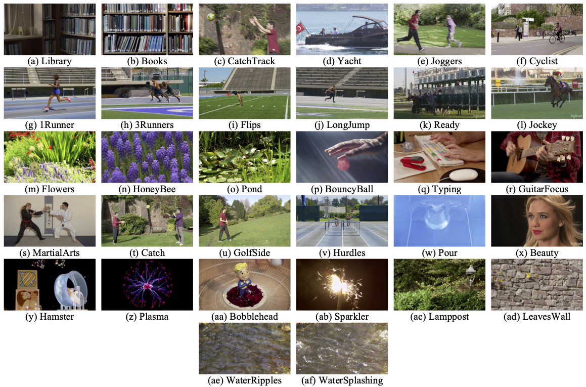

<div align="center">
<h1>  HFR-LS: High Frame Rate Live Streaming Dataset
</div>


<p align="center">
    <font size='4'>
        Test Videos: <a href="https://drive.google.com/file/d/1Rbe4d1smo-0uyu2ToLtJ27S5zH2lXhYx/view?usp=sharing" target="_blank">Google Drive</a> • 
        Reference Videos: <a href="https://drive.google.com/file/d/1PfeZLoEmiahCCGdChC6dJfYGhsRvjyso/view?usp=sharing" target="_blank">Google Drive</a>
    </font>
</p>


<p align="center">
    
</p>


------------------------------------------------------------------------

## 📖 Overview

**HFR-LS (High Frame Rate Live Streaming Dataset)** is a
subjective video quality dataset designed to study the perceptual
trade-offs between **compression strength and frame rate under
bitrate-constrained live streaming scenarios**.

This dataset accompanies the paper:

> **Subjective Evaluation of Frame Rate in Bitrate-Constrained Live
> Streaming**\
> Jiaqi He, Zhengfang Duanmu, Kede Ma\
> *IEEE International Conference on Acoustics, Speech, and Signal
> Processing (ICASSP), 2026*

HFR-LS provides high-quality reference videos and systematically encoded
representations at multiple bitrates and frame rates, together with
**subjective Difference Mean Opinion Scores (DMOS)** collected under
standardized viewing conditions.

------------------------------------------------------------------------

## 🎬 Source Content

-   **32 high-quality source sequences**
-   Originally captured at **120 fps**
-   Converted to **1920×1080, YUV 4:2:0, 8-bit**
-   Duration: **5 seconds**
-   Source sequences:
    -   22 from **BVI-HFR**
    -   5 from **UVG**
    -   5 from **LIVE-YT-HFR**
-   Content diversity: 
    - Camera motion and no camera motion
    - Low to high spatial complexity
    - Low to high temporal activity

Content diversity is characterized using **Spatial Information (SI)**
and **Temporal Information (TI)** according to ITU-T P.910.

------------------------------------------------------------------------

## ⚙️ Encoded Representations

Each source video is encoded using **H.264 (x264)** at fixed 1080p
resolution under realistic live-streaming constraints.

-   **Target Bitrates:** 5, 7, 10, 15 Mbps
-   **Frame Rates:** 30, 60, 120 fps
-   **Total Representations per Source:** 12
-   **Total Processed Videos:** 32 × 12 = **384 clips**

### Encoding Ladder

  |Bitrate |  Frame Rates|
  |---------| -------------------|
  |5 Mbps   | 30 / 60 / 120 fps|
  |7 Mbps   | 30 / 60 / 120 fps|
  |10 Mbps  | 30 / 60 / 120 fps|
  |15 Mbps  | 30 / 60 / 120 fps|

### FFmpeg Encoding Command

``` bash
ffmpeg -f rawvideo -s:v 1920x1080 -r 120 -pix_fmt yuv420p -i input.yuv -r <fps> -c:v libx264 -preset fast -tune zerolatency -b:v <bitrate> -an output.mp4
```

Frame rate down-conversion is performed via frame dropping.

------------------------------------------------------------------------

## 👥 Subjective Study

-   **Protocol:** Single-stimulus with hidden reference
-   **Scale:** Continuous quality scale \[0--100\]
-   **Participants:** 30 naïve subjects (after outlier removal: 26
    valid)
-   **Display:** 120 Hz calibrated monitor
-   **Viewing distance:** \~1.5H

------------------------------------------------------------------------

## 📊 Key Findings Enabled by HFR-LS

-   Frame rate significantly affects perceived quality under fixed
    bitrate.
-   Strong interaction between **bitrate × frame rate × content**.
-   Higher frame rates may degrade spatial quality at insufficient
    bitrate.
-   Existing VQA models struggle with varying frame rate conditions.

------------------------------------------------------------------------

## 📚 Citation

``` bibtex
@inproceedings{He2026HFRLS,
  title={Subjective Evaluation of Frame Rate in Bitrate-Constrained Live Streaming},
  author={He, Jiaqi and Duanmu, Zhengfang and Ma, Kede},
  booktitle={IEEE International Conference on Acoustics, Speech, and Signal Processing (ICASSP)},
  year={2026}
}
```

------------------------------------------------------------------------

## 🏁 License

This dataset is released for **research purposes only**.\
Please refer to the LICENSE file for detailed usage terms.
